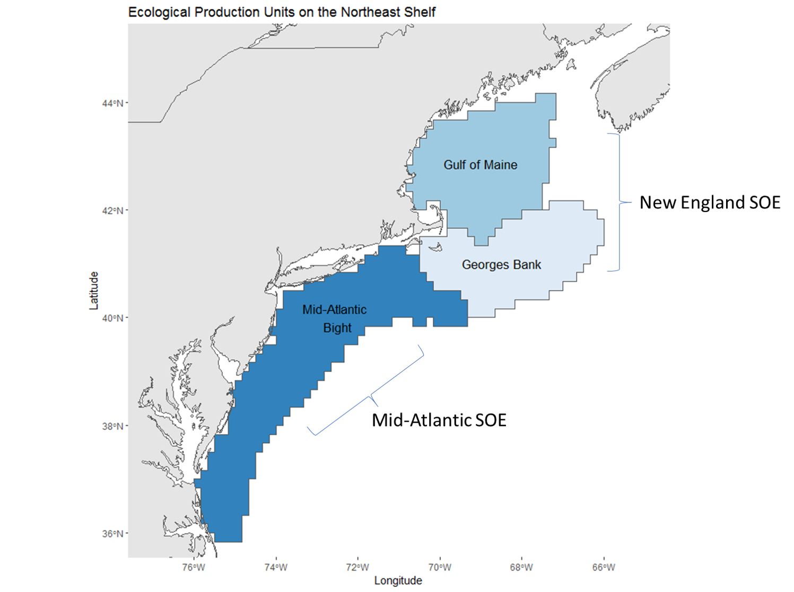
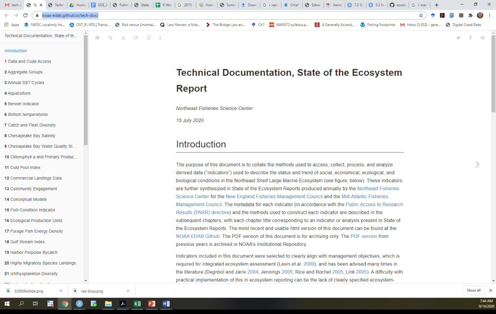
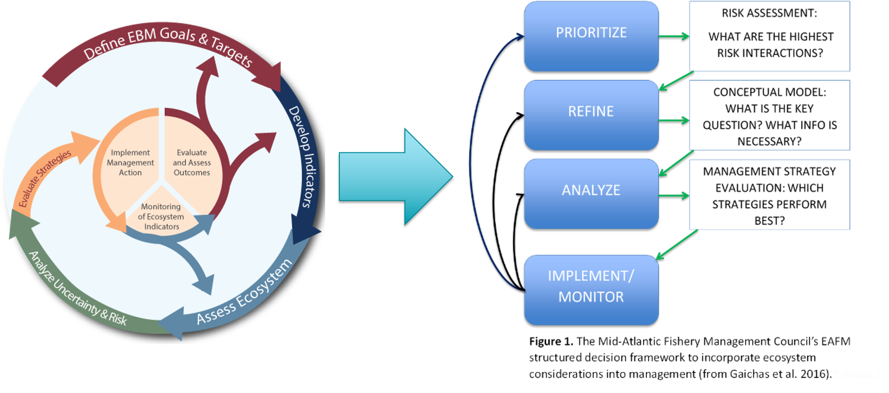
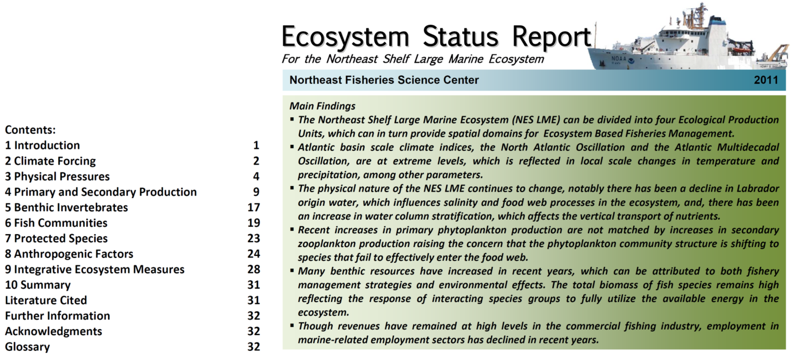
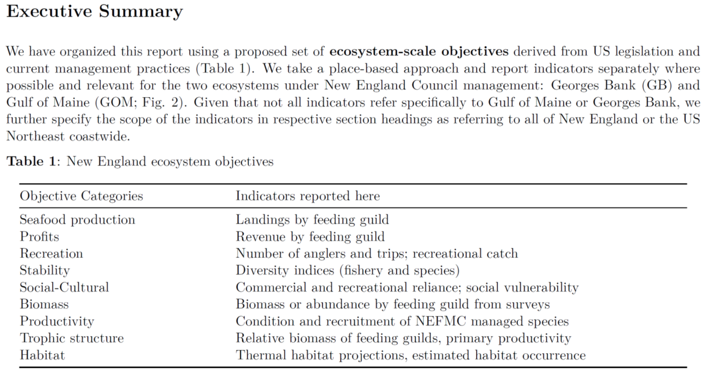
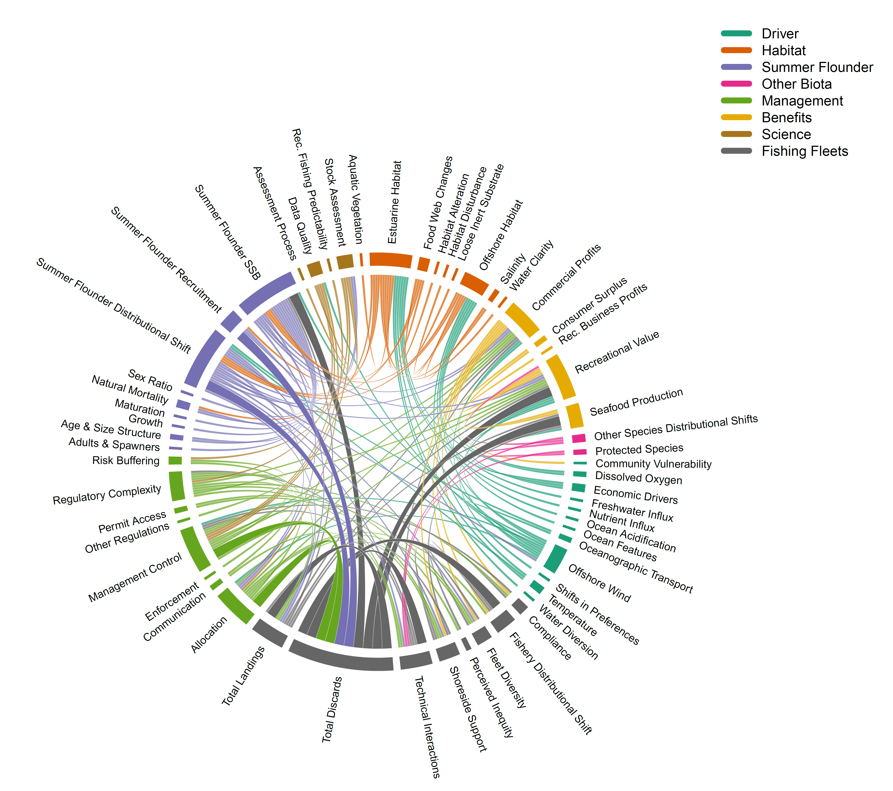
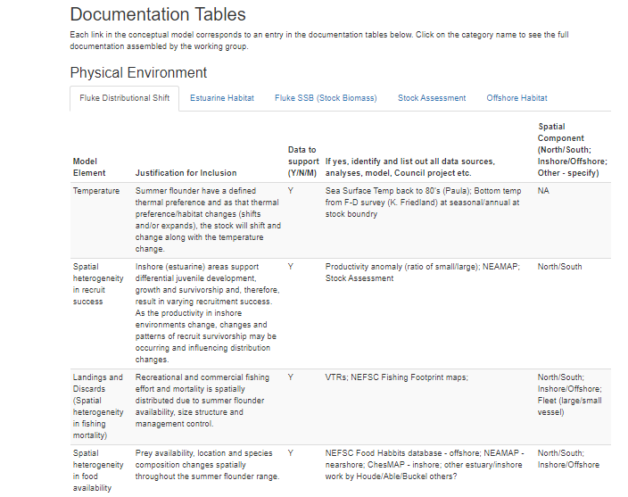
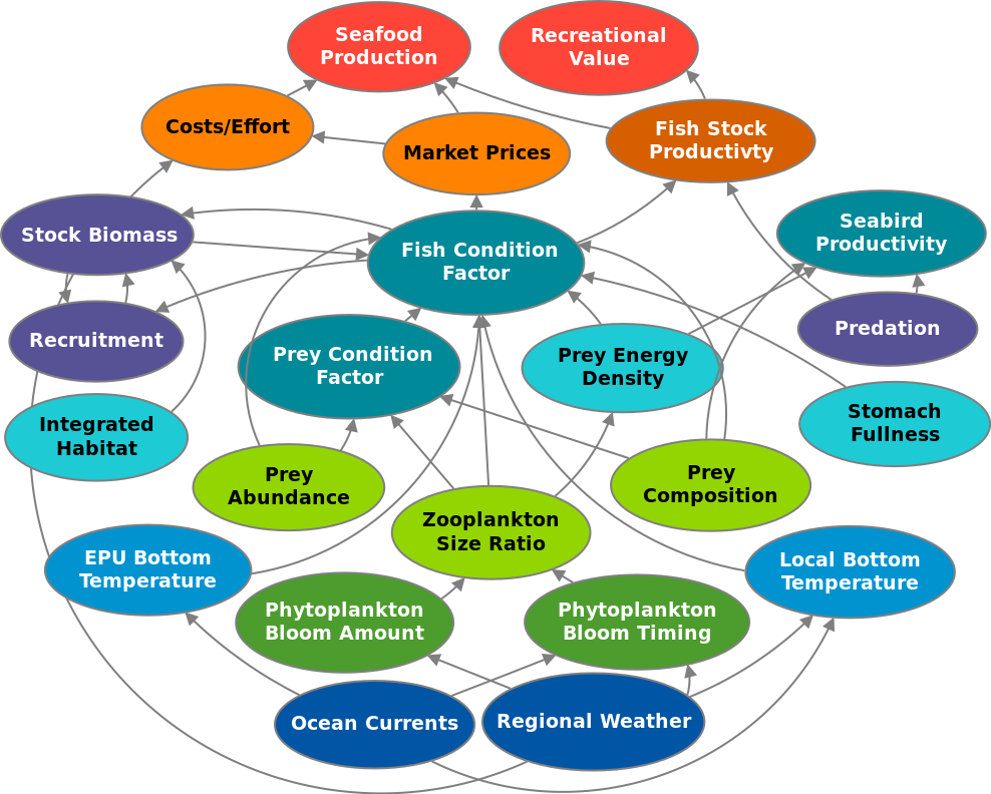
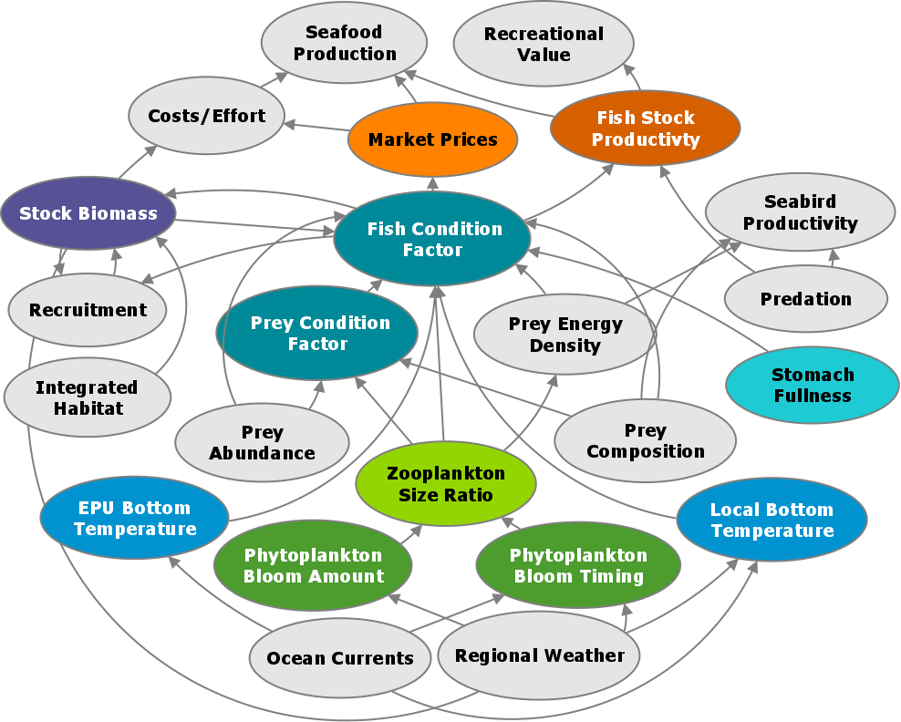

class: top, left

```{r setup, include=FALSE}

options(htmltools.dir.version = FALSE)
knitr::opts_chunk$set(echo = F,
                      warning = F,
                      message = F)
#Plotting and data libraries
library(ggplot2)
library(dplyr)
library(tidyr)
library(here)
library(kableExtra)
library(ggrepel)
library(stringr)
library(patchwork)
library(grid)
library(plotly)
library(vegan)
library(rpart)
library(colorRamps)
library(ecodata)

#GIS libraries
library(sf)
library(rgdal)
#library(raster)
library(rnaturalearth)

data.dir <- here::here("data")

```


## Output from a compilation of work groups
.pull-left[
*Leverage Expertise*
- NOAA National IEA Program

- NOAA Northeast Region IEA Work Group

- ICES WGNARS

- Mid-Atlantic Fishery Management Council (MAFMC) EAFM Work Group

]

.pull-right[*Integrated Ecosystem Assessment*


.image-cap[Reproduced from Levin, P. S., Fogarty, M. J, Murawski, S. A., and Fluharty, D. (2009) with permission from NOAA Fisheries. <br />
https://www.integratedecosystemassessment.noaa.gov/national/IEA-approach
]
]
???
---

## Reports tailored to clients

.pull-left[
* MAFMC

* New England Fishery Management Council

* Fishery Focused, with some information on competing uses
  + Wind
  
  + Aquaculture
]
.pull-right[


.image-cap[Ecological production units mapped to State of the Ecosystem Reports.
]
]

???

---
## Open Science Concepts

.pull-left[
* Allowed for shift from collecting & processing data to communicating

  + Transparency
  
  + Reproducibility
  
  + Standardization
  
* R combined with Github
    
    + Automation
    
    + Customization
    
    + Version Control
    
    + Ease of updating
    ]
    
.pull-right[

  .image-cap[Online Technical Documentation details metadata, analyses, and full data provenance.
  https://noaa-edab.github.io/tech-doc/
] 
    ]
???

---
## Mid-Atlantic Fishery Management Council Example



???
---
## Report Evolution: **2012**


???
---

## Report Evolution: **2017**

.center[
]

???
---
## Transition from Risk Assessment to MSE:

## MAFMC requested a conceptual model for summer flounder fishery-ecosystem interactions, inventory of data availability and gaps, applicable models, and example management questions which could be addressed with this knowledge base.
```{r, out.width = "525px",fig.align="center",hugoopts = list(alt="Summer Flounder conceptual model with discards highlighted.")}

```


???
---
```{r sfconceptmod, echo = F, fig.align = "center"}
# setup for conceptual model
PKG <- c(#"foreign","foodweb","sna", "DiagrammeR","circlize", "kableExtra", "googledrive", "readxl"
         "RColorBrewer","QPress",
         "chorddiag",
         "widgetframe")

for (p in PKG) {
  if(!require(p,character.only = TRUE)) {
    install.packages(p)
    require(p,character.only = TRUE)}
}


#assumes this is a project and .dia file is in data directory
edges <- model.dia(file.path(data.dir, "Summer_Flounder_July22_2019.dia"))

source("R/interactive_chord_sfconsmod.R")

conmod <- interactive_chord_sfconsmod(edges, width=650, height=650, margin=130)

frameWidget(conmod)

```
???
In this interactive circular graph visualization, model elements identified as important by the Council (through risk assessment) and by the working group (through a range of experience and expertise) are at the perimeter of the circle. Elements are defined in detail in the last section of [this page](https://gdepiper.github.io/Summer_Flounder_Conceptual_Models/sfconsmod_riskfactors_subplots.html). Relationships between elements are represented as links across the center of the circle to other elements on the perimeter. Links from a model element that affect another element start wide at the base and are color coded to match the category of the element they affect.Hover over a perimeter section (an element) to see all relationships for that element, including links from other elements. Hover over a link to see what it connects. Links by default show text for the two elements and the direction of the relationship (1 for relationship, 0 for no relationship--most links are one direction).For example, hovering over the element "Total Landings" in the full model shows that the working group identified the elements affected by landings as Seafood Production, Recreational Value, and Commercial Profits (three links leading out from landings), and the elements affecting landings as Fluke SSB, Fluke Distributional Shift, Risk Buffering, Management Control, Total Discards, and Shoreside Support (6 links leading into Total Landings).


???
---
## Linkage Documentation integrated into conceptual model presentation

```{r, out.width = "650px", fig.align="center",hugoopts = list(alt="Summer Flounder conceptual model support table defining linkages and data available.")}

```
https://gdepiper.github.io/Summer_Flounder_Conceptual_Models/sfconsmod_riskfactors_subplots.html
???
---
## MAFMC developing an MSE around question derived from conceptual model

## Evaluate the biological and economic benefits of minimizing summer flounder discards and converting discards into landings in the recreational sector. Identify management strategies to effectively realize these benefits.
.pull-left[
* Opportunity to align EAFM work with traditional Council process
* Management challenges to address and reduce regulatory discards
    + 90% of rec summer flounder catch is released
* Raised by AP members and stakeholders seeking management to address
* EAFM issue and focus – seven linked categories: Management, Summer Flounder Stock, Science, Fishing Fleets, and Benefits 
]
.pull-right[

]
???
---
## Synthetic products under development

.pull-left[
* Fish Condition Conceptual Model

  + Indicators linked to management objectives
  
    + Drivers
    
    + Impacts on management objectives
]
.pull-right[

]
???
---
## Synthetic products under development

.pull-left[
* Subset of linkages statistically investigated

  + Generalized Additive Models
  
  + Hedonic price functions
    
  + Future extensions
  
    + Sctructural Equation Modeling
]
.pull-right[

]
???
---
## Questions? Thank you!

* [Mid-Atlantic Council EAFM paper](https://www.frontiersin.org/articles/10.3389/fmars.2016.00105/full)

* [Mid-Atlantic Council Risk Assessment paper](https://www.frontiersin.org/articles/10.3389/fmars.2018.00442/full#h11)

* [Mid-Atlantic Council Summer Flounder conceptual model, support tables](https://gdepiper.github.io/Summer_Flounder_Conceptual_Models/sfconsmod_riskfactors_subplots.html)

* [Management questions and conceptual model](https://gdepiper.github.io/Summer_Flounder_Conceptual_Models/sfconsmod_final_2col.html) 
  
* [Mid-Atantic April 2020 EAFM updates, including SOE](https://www.mafmc.org/s/Tab01_2020-SOE-Report_2020-04.pdf)

* Slides available at https://noaa-edab.github.io/presentations

.pull-left[
Contacts:  
]
.pull-right[
geret.depiper@noaa.gov

sarah.gaichas@noaa.gov  

sean.lucey@noaa.gov

]